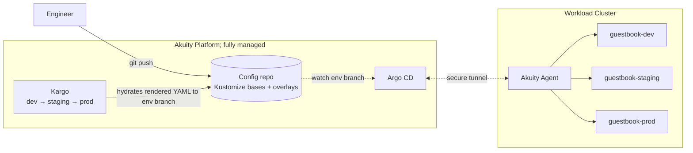

# Tier 0: Kustomize + Kargo

**Implementation:** see [`README.md`](README.md)

**Profile:** Five to twenty engineers. One workload cluster. Two environments at the start, three by the time anyone reads this. No platform team; the CTO is also the SRE. The first release process started as a `kubectl apply` script and is in its third rewrite.

## Architecture

## What this shows

The simplest possible GitOps shape that still has a real promotion story. The customer owns one cluster and one config repo. Everything else — the Argo CD control plane, the Kargo controller, the upgrade path — lives inside Akuity. The agent on the workload cluster is the only Akuity-installed component the customer manages, and it phones home over an outbound tunnel so there is no inbound network surface to harden.

The promotion currency is the **rendered manifest pattern** (which is an anti-pattern and common at this level). Kargo runs `kustomize build` in CI, commits the output to an env-specific git branch or back to the repo itself. Argo CD applies plain Kubernetes YAML. PR diffs are literal API objects, not values changes. This is the smallest investment that delivers byte-identical promotion across environments.

## Where Akuity fits

The value proposition is *they do not have to run Argo CD or build a promotion process themselves.* Self-hosted Argo CD looks free until someone has to upgrade it, debug a stuck sync, recover from an OOMed application controller, or wire SSO for the first auditor. Kargo replaces the bash-and-prayer promotion script every team writes and then regrets. Time-to-first-deploy on Akuity is hours; rolling your own is weeks plus a permanent on-call rotation.

## Tradeoffs and what's missing

Deliberately absent at this tier: Helm (Kustomize patches scale fine for small overlays), SSO (founders are the only operators), audit logs (no auditor yet), Crossplane (no shared services to compose), ApplicationSet cluster generators (one cluster, no fan-out). Adding any of these here is over-engineering. The honest SE conversation is "you'll grow into the rest of the platform; here is what triggers each next step."

The trigger from tier 0 to tier 1 is almost always *the moment a values change becomes more readable than a kustomize patch*. This is usually the second time someone has to fork a base because conditional logic doesn't compose well in pure Kustomize. Helm wins at the templating leverage threshold; nothing else changes.
