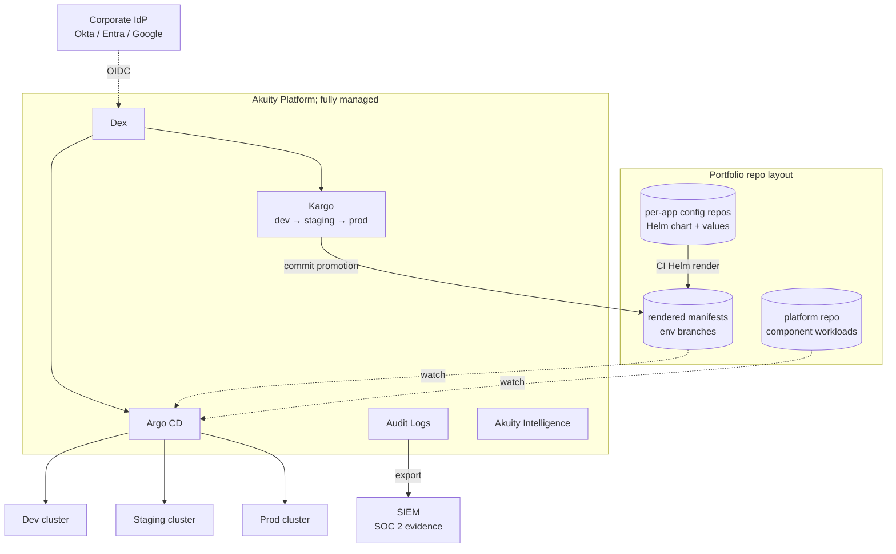
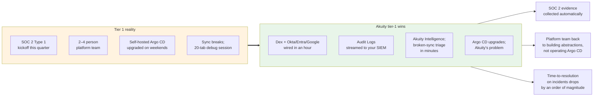

# Tier 1: Helm + Kargo

**Implementation:** see [`README.md`](README.md)

**Profile:** Fifty to two-hundred engineers. Two or three clusters separated by environment. Multiple product teams. A small platform or DevOps team has formed. The first SOC 2 audit is on the calendar or just behind them.

## Architecture

## What changed from tier 0

Three things become visible at tier 1 that were absent at tier 0. First, **Helm replaces Kustomize as the templating layer**; the chart's values composition wins at the moment overlays start carrying real configuration (resource sizes, optional sidecars, conditional NetworkPolicies). The promotion currency does not change as Kargo still hydrates rendered YAML to env branches, Argo CD still applies plain manifests.

Second, **the IdP enters the picture**. SSO is not optional once you have ten engineers and an auditor. Akuity's Dex integration handles the standard connectors (Okta, Entra, Google Workspace, GitHub) without the platform team operating Dex themselves.

Third, **the repo layout goes portfolio-style**. Per-application config repos owned by the teams that ship them, plus a separate platform repo for shared component workloads. The platform repo holds Traefik, cert-manager, Kargo CRs; the per-app repos hold charts and per-env values. The boundary maps cleanly to AppProject RBAC.

## Where Akuity fits

Compliance-grade GitOps as a service. Audit logs and SSO stop being nice-to-haves the moment the auditor asks for them, and self-hosting Argo CD at this stage means the platform team owns the security posture of the GitOps control plane itself. Akuity absorbs that. Akuity Intelligence starts paying for itself here because investigation time on broken syncs is now a real budget line, and the platform team is small enough that every hour spent debugging Argo CD internals is an hour not spent on the abstractions their developers actually need.

## The buying conversation

The pitch in one sentence: *your platform team is too small to operate Argo CD AND build an internal platform; pick one and let us handle the other.* Audit logs and SSO are the wedge; Intelligence is the deal-closer once they see how much time it saves on a single P1 sync.

## Tradeoffs and what's missing

Deliberately absent: Crossplane (the platform team is still small enough that Terraform or Pulumi for cloud infra works fine), multi-region (one geography, one set of clusters), cluster lifecycle automation (clusters change rarely enough that clicking through cloud consoles is acceptable). The portfolio-vs-monorepo question lands here, and the honest answer at this tier is portfolio. One config repo per business app owned by that team, plus one platform repo for shared component workloads. Monorepo is more attractive when a single platform team owns everything; it becomes a bottleneck the moment ownership distributes due to conway's law.

The trigger from tier 1 to tier 2 is the first time a team needs an external Postgres (or queue, cache, S3 bucket) and the platform team has not yet given them a sanctioned way to provision it. The first team does it in Terraform from a laptop. The second team copy-pastes their module. By the third team, you are at tier 2.
