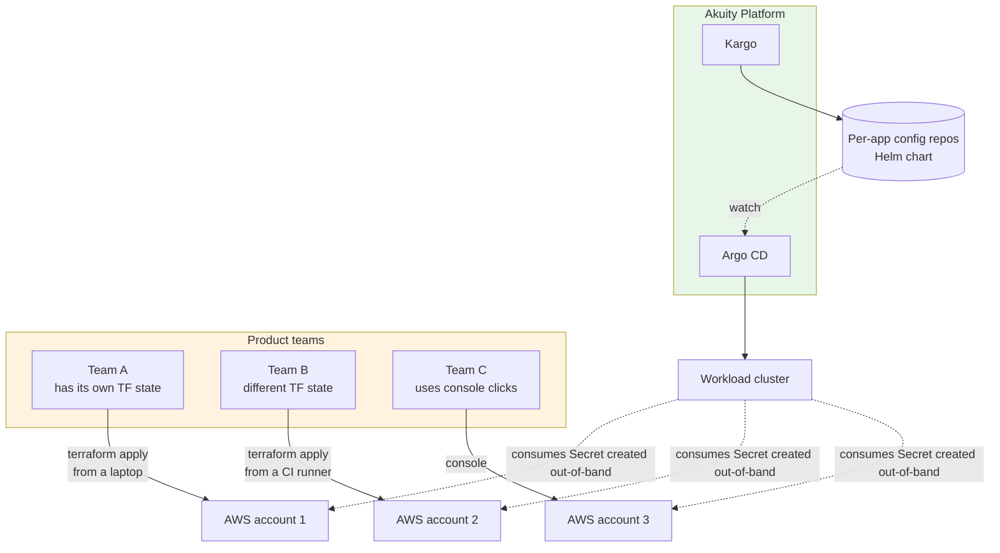

# Tier 2: Terraform + Helm (Wild West)

**Implementation:** see [`README.md`](README.md)

**Profile:** Same headcount as tier 1, but a year later. Multiple teams now own external infrastructure (databases, queues, caches, S3 buckets) and each has built their own pattern for it. The platform team is one or two engineers and has not yet been authorized to put guardrails around how teams provision infra. The first SOC 2 evidence collection ran into the question "who owns the Postgres in the prod-payments account?" and nobody had a clean answer.

## Architecture

## What this tier shows

The promotion story is the same as tier 1. The chart is the same. The Kargo flow is the same. **What changes is the seam.** GitOps owns the application; Terraform owns the database; **nothing owns the join.**

Each team provisions its own backing infra. The Terraform state lives in five different places. The Kubernetes Secret carrying the connection string is created by `terraform apply` and lands in the app namespace, where the chart's `envFrom` reads it. There is no contract that the Secret name in Terraform output matches the Secret name in the chart's values. There is no review gate between "developer presses apply" and "production database changes." There is no drift detection.

This is where most growth-stage organizations actually live. They have a working GitOps pipeline for their apps and a wild-west backstory for their infra. The pain shows up at the SOC 2 review and at the post-incident retro, not in the day-to-day.

## Where Akuity fits

Akuity does **not** solve the wild-west problem at this tier. Akuity reconciles git, and the wild west is not in git. What Akuity does provide is the **substrate** the platform team will use to fix it — when they get the headcount to author a Crossplane abstraction (tier 3), Akuity reconciles the resulting claims and Compositions exactly the same way it reconciles every other manifest. The tier-3 transition does not require switching GitOps platforms; it requires the platform team being authorized to define abstractions.

The honest SE conversation here is "we can show you how the next tier closes these gaps; we cannot close them for you because the gap is organizational, not technical."

## Packaging model: from rendered branches to immutable artifacts

Tier 0 and tier 1 use the **rendered-manifests pattern**: Kargo runs `kustomize build` or `helm template` and commits hydrated YAML to an `env/<stage>` branch. Argo CD watches the branch. Promotion currency is a git commit SHA on the config repo. This is the cheapest thing that works and the right call when the team is small.

Tier 2 is where it stops being the right call. The same audit conversation that exposes the wild-west database problem also exposes the rendered-branch problem:

- **No artifact lineage.** "Which build of the chart is in prod?" answers with a git SHA on a long-lived branch. There is no SBOM attached, no signature, no link back to the build pipeline that produced it. The auditor wants a digest.
- **No out-of-band rollback.** Rolling back means rebuilding from a previous source SHA and re-rendering. If the rendering pipeline is broken, prod is stuck.
- **Branch drift.** `env/prod` is a mutable pointer. Force-pushes, accidental merges, or a Kargo step crash mid-promotion can leave it in a state that does not correspond to any review-gated commit.
- **Supply chain gap.** Kyverno's `verifyImages` rule needs a digest to verify against. A branch HEAD does not have one.

The tier-2 evolution is to publish the chart as an **immutable OCI artifact** alongside (or instead of) the rendered branch, and have Argo CD reference it by digest:

| Concern | Rendered-branch (tier 0/1) | OCI-artifact (tier 2 onward) |
| --- | --- | --- |
| Promotion currency | Git commit SHA on `env/<stage>` | `oci://registry/chart@sha256:...` |
| Build output | Hydrated YAML in git | Helm chart `.tgz` in OCI registry |
| Rollback | Rebuild from previous source SHA | Re-pin previous digest, no rebuild |
| Signature | None — git commit signing optional | Cosign signature on the digest |
| SBOM | Not attached | Attached as OCI referrer |
| Kargo step | `helm-template` + `git-commit` + `git-push` | `helm-package` + `helm-push-chart` |
| Argo CD source | `repoURL: <git>, path: rendered/<env>` | `repoURL: oci://..., chart: ..., targetRevision: <semver>` |
| Kargo Warehouse subscription | Image tag only | Image tag **+** chart version |

Freight identity stops being "the bytes Kargo committed to a branch" and becomes "this signed OCI digest." Promotion is `helm-update-chart` re-pinning a chart version on the next stage — no render step, no copy, no branch write. The env branch can stay around as an audit-friendly hydrated view, but it is no longer the source of truth.

The Akuity-side mechanics are unchanged: Argo CD already supports OCI Helm sources, Kargo's Warehouse subscribes to chart versions the same way it subscribes to image tags, and the verification probe still runs after `argocd-update`. What changes is what the platform team can hand to the auditor and to the security team — a digest, a signature, an SBOM — instead of a branch name.

This is also the moment the same artifact discipline starts applying to platform components. ingress, cert-manager, and Kyverno already publish signed charts; pinning them by digest in the platform AppProject closes a real supply-chain hole that a values-only Application does not.

The trigger to actually do this is usually whichever comes first: the security team asks for cosign verification at admission, or the second time someone has to roll back prod and the rendered-branch flow fights them.

## Tradeoffs and what's missing

This is the only tier that is *intentionally* incomplete. Listing the failure modes:

- **State location is unknowable.** A Terraform module without a backend declaration leaves it up to whoever runs it. Five teams will pick five different things, and three of them will lose state at least once.
- **No review gate.** Anyone with the AWS creds and the kubeconfig can `terraform apply` straight to prod.
- **Drift is silent.** A console click changes the live DB; the next apply quietly reverts it (or, worse, does not, because the team never re-runs it).
- **No standards.** Postgres 16? db.t4g.micro? Encryption at rest? Each team picked whatever was in the docs the day they started. They are not the same.
- **No promotion of infra.** Kargo promotes the image tag dev → staging → prod. The database schema does not move with it. There is no contract that says "the staging DB has the columns the staging app expects."

The trigger from tier 2 to tier 3 is the first executive meeting where the auditor or the CISO asks "show me how a database gets approved before it gets created in production." If the answer is "the team just decides," tier 3 starts the next day.
