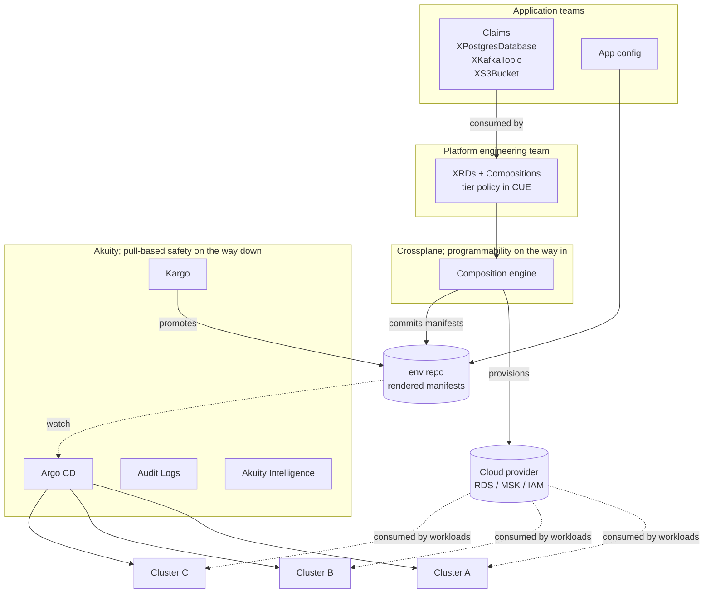

# Tier 3: Crossplane + Helm

**Implementation:** see [`README.md`](README.md)

**Profile:** Five-hundred to several-thousand engineers. Five to fifty clusters across multiple cloud accounts and possibly multiple cloud providers. A dedicated platform engineering team of ten or more, owning shared services (databases, queues, caches, secret management, observability stack) as products with their own SLAs.

## Architecture

## What this shows

This is the canonical two-loop story. **Crossplane is programmability on the way in**; application teams file claims like `XPostgresDatabase` against XRDs the platform team publishes, and Crossplane's composition engine expands those claims into actual cloud resources, IRSA roles, secrets, and the namespace-scoped manifests that consume them. **Akuity is pull-based safety on the way down**; the rendered manifests get committed to an env repo, Kargo promotes them across stages, and Argo CD reconciles them onto the workload clusters. Neither system tries to do the other's job. The platform team owns the abstractions in between.

## Where Akuity fits

This is where the multi-tenant, multi-cluster, fleet-aware features earn their keep. AppProject-level RBAC mapped to platform-vs-application-team boundaries. ApplicationSet cluster generators rolling new component workloads across the fleet without per-cluster YAML. Audit logs are now table stakes for security review of *every* deployment, not just compliance-window evidence. The buying conversation shifts to "we built a platform; we need a managed control plane for the GitOps half of it so our platform team can focus on the abstractions, not on operating Argo CD at scale." Self-hosting becomes viable here in raw cost terms, but rarely in opportunity-cost terms; the platform team's time is the constraint.

## The objection you will get

Crossplane is sometimes positioned as competitive with Argo CD because both reconcile against a desired state. They are not. Crossplane reconciles *infrastructure it composed*; Akuity reconciles *manifests in git*. Customers running both should land on the pattern above (Crossplane composes infrastructure that Akuity leverages in deployments ), not on a fight between the two reconciliation loops. This is the conversation that saves deals where the customer walked in expecting a turf war.

## You don't have to throw away tier 2's Terraform

A common misread of this tier is "the platform team rewrites all the wild-west Terraform from tier 2 as Crossplane Compositions." That's one valid path, but it's not the only one — and for most companies it's not the cheapest one.

The alternative: **keep the Terraform modules and put a Kubernetes operator in front of them.** The patterns:

- **Crossplane `provider-terraform`** lets a Composition wrap a Terraform module as a managed resource. The XRD claim still exists, the app team still files three lines, and Crossplane reconciles the Terraform module the same way it would reconcile a native CRD. The module from tier 2 (`2-terraform+helm/terraform/postgres/`) becomes the body of the Composition.
- **Flux's `tf-controller`** does the same job from the Flux side — `Terraform` CR points at a module, the operator runs plan + apply on a reconcile loop, drift detection becomes built-in.
- **HashiCorp's official Terraform Operator** (cluster controller for Terraform Cloud / Enterprise) is the path if the company already pays for TFC and wants to keep state there.

What the platform team buys with this approach:
- **No rewrite cost.** The Terraform module that was already provisioning Postgres at tier 2 is now reconciled inside the GitOps loop.
- **State lives in one declared place.** No more "it's in S3 — wait, which S3?" because the operator owns the backend.
- **Drift detection arrives free.** The operator's reconcile loop is what tier 2's `postgres-secret-watcher` Application was *trying* to be.
- **Crossplane Compositions become an option, not a mandate.** Some abstractions are easier as Terraform modules; some are easier as native CRD compositions. The platform team picks per resource.

The honest tradeoffs:
- **You inherit Terraform's debugging UX inside Kubernetes.** `kubectl describe` showing 2,000 lines of `terraform plan` output is a real thing that happens.
- **The Composition + Terraform-operator combo has two reconcile loops** (Crossplane + the Terraform operator), and they can fight in pathological cases.
- **Provider-native Crossplane is faster to debug** when the resource is something Crossplane has a first-class provider for (RDS, S3, IAM). Provider-Terraform is the right answer when the resource is something only Terraform has covered well (a SaaS provider, a niche cloud, an internal API).

For this repo, the tier-3 Compositions go straight to provider-helm (the bitnami chart) for review portability. In a real customer setup you'd see a mix: provider-aws for RDS and IAM (tier-3-native), provider-terraform wrapping the tier-2 modules for SaaS and internal-API resources (tier-2-derived), all behind the same XRD. The app team never sees the difference.

This is the SE conversation when a customer says "we already have a lot of Terraform — does adopting Crossplane mean we throw all of it away?" The answer is no, you wrap it.

## Tradeoffs and what's missing

The honest costs of the seed-to-spoke pattern bite here: `provider-kubernetes` is chatty, two-hop debugging gets long (claim → managed resource → Object on seed → actual resource on spoke), credential rotation is N spoke kubeconfigs not one. Multi-region is still absent at this tier; this is one geography or a small number of geographies. The trigger from tier 3 to tier 4 is the moment regional sovereignty, latency, or regulatory boundaries force the platform team to think in terms of *fleets of fleets* instead of one fleet.
