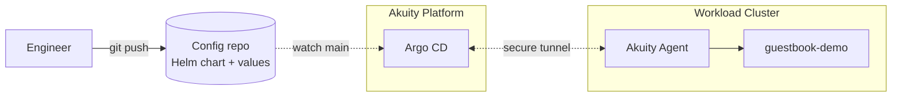

# demo: Helm + Argo CD, single environment

**Implementation:** see [`README.md`](README.md)

**Profile:** A single engineer. A weekend project, an internal tool, a
proof-of-concept that needs to run somewhere. One cluster, one namespace,
one app. Two environments would be a stretch goal.

## Architecture

## What this shows

The shortest possible Argo CD path. One Application, multi-source Helm
(chart from the repo, values from the same repo), single namespace.
`kubectl apply -k demo/argocd/` bootstraps it. Push a values change to
main, Argo CD picks it up within a poll cycle, syncs the chart against
the cluster.

No Kargo. No promotion. No env branches. No rendered-manifests pattern.
A values change *is* a deploy — the same way a `helm upgrade` would be,
except Argo CD owns the lifecycle.

## Where Akuity fits

The customer doesn't run Argo CD themselves. They register their cluster
with Akuity, point an Application at this folder, sync. Done. The pitch
at this stage isn't promotion or governance — it's "Argo CD as a service
so you can stop thinking about it."

## When this stops fitting

The moment a second environment shows up. Two namespaces with subtly
different values means either copy-pasting Applications (tedious, drifts)
or starting to template the bootstrap itself. Both are signals to move
to tier 1, where Helm values are split per env and Kargo carries
freight from one to the next.

## Tradeoffs and what's missing

Deliberately absent: Kargo (one env, no promotion to gate), Argo Rollouts
(no canary needed when there's no production), kube-prometheus-stack
(Akuity Intelligence is enough at this scale), AppProjects beyond
`demo` (no separation needed), per-env values overlays (one env). Every
one of these earns its keep at a higher tier; none of them earn it here.

The trigger from demo to tier 0 / tier 1 is *the moment a deploy becomes
something a second person needs to be able to safely repeat.* Until then,
the Argo CD UI sync button is the entire promotion process.
