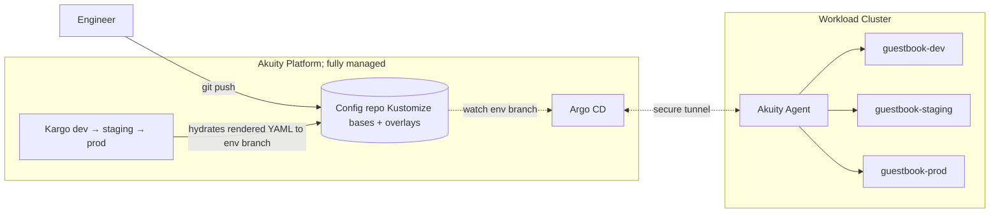
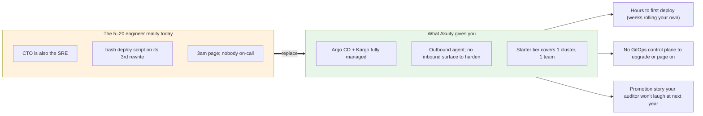
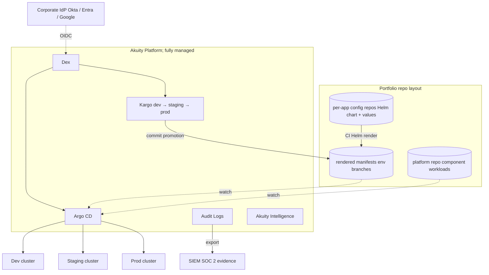
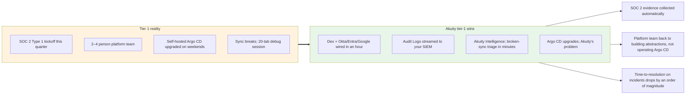
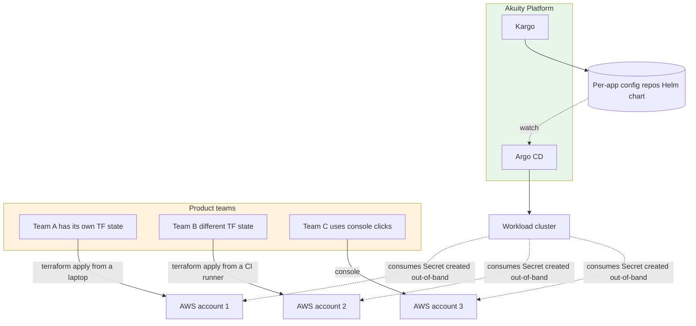
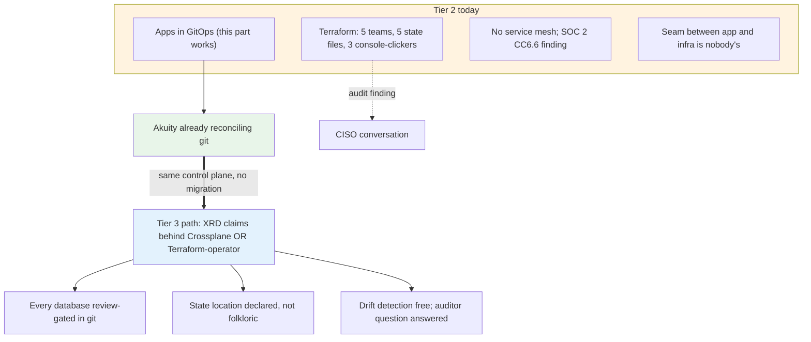
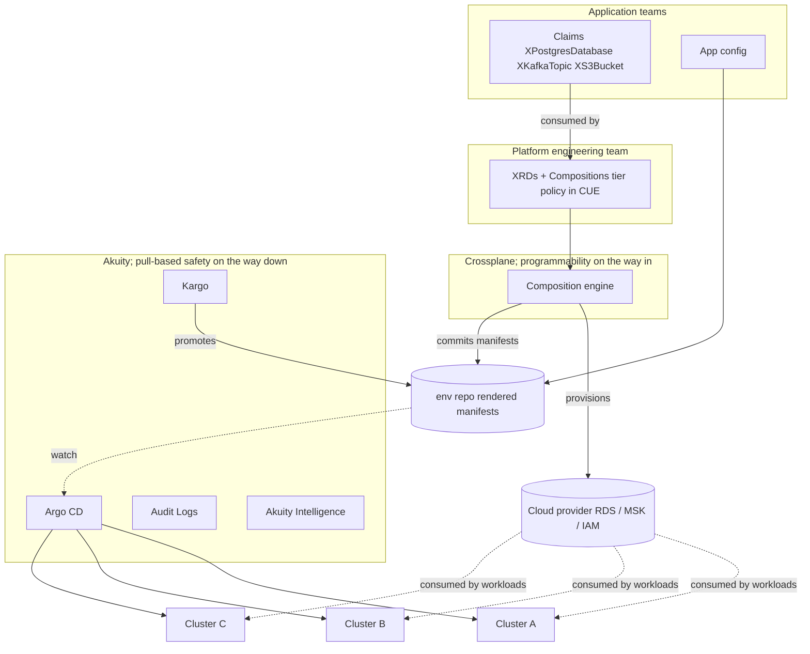
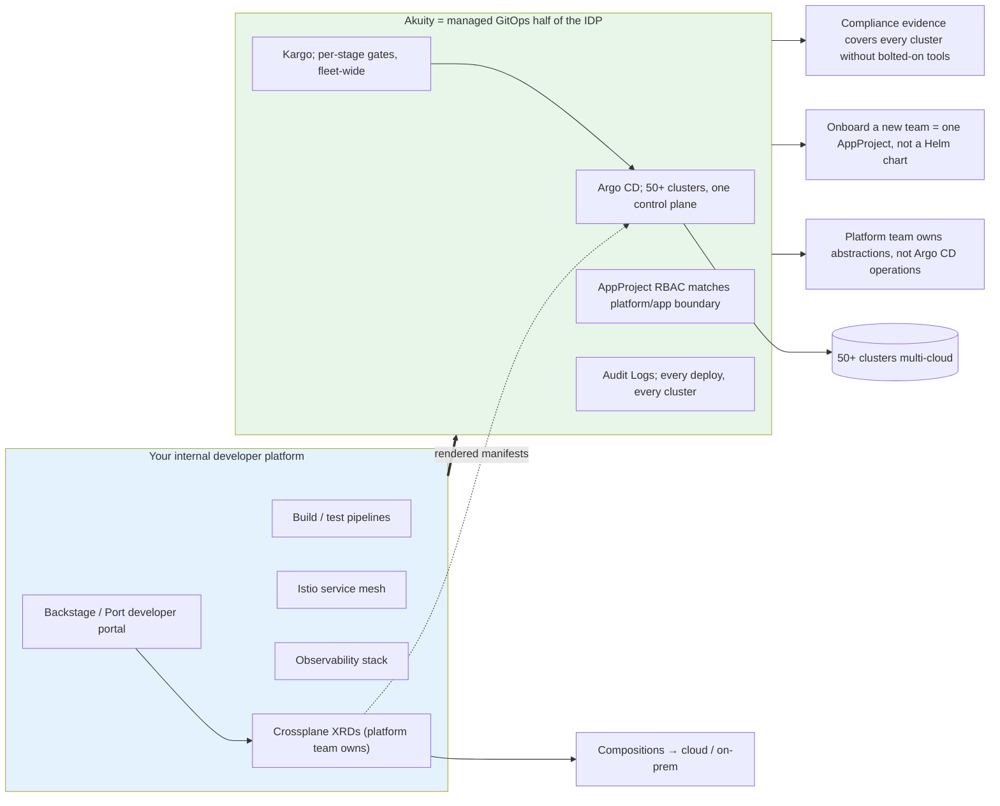
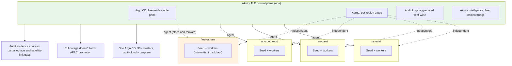

# Diagrams

All architecture and buying-conversation diagrams across the five tiers, in one place. Each is duplicated in its tier's `NARRATIVE.md`; this page is a single-pane view for reviewers who want the visual sweep without reading the prose.

---

## Tier 0 — Kustomize + Kargo

### Architecture

### Buying conversation

---

## Tier 1 — Helm + Kargo

### Architecture

### Buying conversation

---

## Tier 2 — Terraform + Helm (Wild West)

### Architecture

### Buying conversation

---

## Tier 3 — Crossplane + Helm

### Architecture

### Buying conversation

---

## Tier 4 — Hybrid Multicloud

### Architecture (TLD → seed → worker, plus edge)

```mermaid
flowchart TB
    subgraph TLD["TLD control plane"]
        TLDGit[("Org git + policy repos")]
        TLDArgo["Akuity-managed Argo CD one instance, fleet-wide"]
        TLDKargo["Akuity-managed Kargo per-region gates"]
        TLDIntel["Akuity Intelligence fleet-wide Audit Logs"]
    end

    subgraph Regions["Always-connected regions"]
        direction LR
        subgraph USRegion["us-east"]
            SeedUS["Seed cluster Crossplane + Cluster API"]
            WorkerUS1["Worker guestbook-prod"]
            WorkerUS2["Worker orders-prod"]
            SeedUS -->|provisions| WorkerUS1
            SeedUS -->|provisions| WorkerUS2
        end
        subgraph EURegion["eu-west"]
            SeedEU["Seed cluster Crossplane + Cluster API"]
            WorkerEU1["Worker guestbook-prod"]
            WorkerEU2["Worker orders-prod"]
            SeedEU --> WorkerEU1
            SeedEU --> WorkerEU2
        end
        subgraph APRegion["ap-southeast"]
            SeedAP["Seed cluster Crossplane + Cluster API"]
            WorkerAP1["Worker guestbook-prod"]
            WorkerAP2["Worker orders-prod"]
            SeedAP --> WorkerAP1
            SeedAP --> WorkerAP2
        end
    end

    subgraph Edge["Intermittently-connected edge"]
        direction LR
        SeedShip["Onboard seed cruise ship / rig / remote site"]
        WorkerShip["Worker ship workloads"]
        SeedShip -->|provisions| WorkerShip
    end

    TLDGit -.->|watched by| TLDArgo
    TLDArgo -->|agent| WorkerUS1
    TLDArgo -->|agent| WorkerUS2
    TLDArgo -->|agent| WorkerEU1
    TLDArgo -->|agent| WorkerEU2
    TLDArgo -->|agent| WorkerAP1
    TLDArgo -->|agent| WorkerAP2
    TLDArgo -.->|"agent (intermittent backhaul)"| WorkerShip
    TLDKargo -. independent gate .-> USRegion
    TLDKargo -. independent gate .-> EURegion
    TLDKargo -. independent gate .-> APRegion
    TLDKargo -. independent gate .-> Edge
```

### Buying conversation

